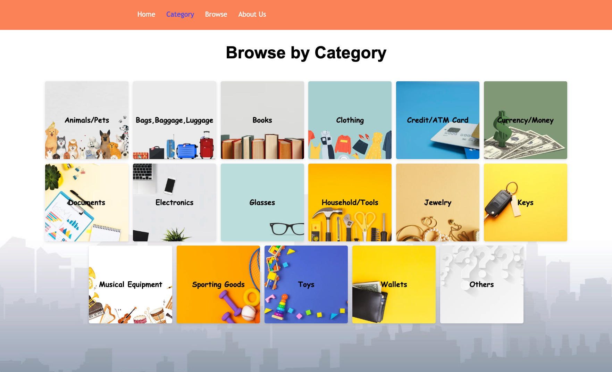

# Lost & Found - Broadlands, VA

Individual Capstone Project by Lisa Feng

## Project Description

Lost & Found center is designed especially for Boradlands residents. The purpose of this website is to ensure all lost and found pets and properties are returned to their rightful owner promptly and efficiently. For someone who found something, they can create posts. For someone who lost something, they can browse all the posts others post to see if they can find what they lost.

Project Link: [Lost & Found - Broadlands](https://lost-and-found-broadlands.herokuapp.com/)

## Learning Goals

- Learn to use Node JS and Express Js
- Learn to use more React Component Libraries
- Learn how to conncet Node JS with Postgres Database
- Learn to build file/image upload
- Learn to use Google Firebase

## Project Type

Website

## Main Front-end Technology

- React
- CSS

## Main Back-end Technology

- JavaScript - Node/Express

## Database

- PostgreSQL
- Google Firebase

## Deployment Technologies

- Heroku

## MVP Feature Set

- Users should be able to create a post includes upload a image
- Users should be able to browse all the posts
- Users should be able to browse by category
- Users should be able to claim an item then get the finder's information

## Additional Feature Set (If with more time)

- Users should be able to sign up and log in to the accout
- Users should be able to manage their posts (update, delete)
- Users should be able to search by keyword

## Other Links

Link to the [Backend repository](https://github.com/lisafenglisa/back-end-lost-and-found)

## Website Screenshots

